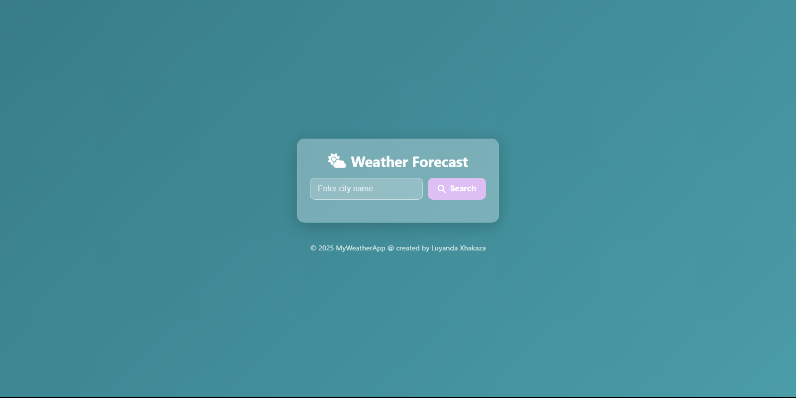

# 🌦️ Weather Forecast App

  

A clean, responsive weather application that displays current weather conditions and hourly forecasts for any city worldwide.

## 🔗 Live Demo
Check out the live demo here: [https://luyandaaaa.github.io/Weather_app/](https://luyandaaaa.github.io/Weather_app/)

## ✨ Features
- 🌍 Real-time weather data for any city
- 🌡️ Current temperature with "feels like" information
- ☀️🌧️ Weather condition descriptions
- 💧 Humidity and 💨 wind speed display
- ⏱️ 24-hour hourly forecast
- 📱 Responsive design for all device sizes
- ❌ Error handling for invalid city names
- 🎨 Beautiful UI with animated elements

## 🛠️ Technologies Used
- 
- 
- 
- 
- 

##💻 Usage
🔍 Enter a city name in the search box

🔎 Click the search button or press Enter

📊 View current weather conditions and hourly forecast

##📂 Code Structure
Weather_app/
├── 📄 index.html        # Main HTML file
├── � style.css         # CSS styles
├── 📜 script.js         # JavaScript functionality
└── 📝 README.md         # Project documentation

##🌐 API Reference
This app uses the OpenWeatherMap API:

Current weather data endpoint

5-day/3-hour forecast endpoint

##📜 License
This project is open source and available under the MIT License.
